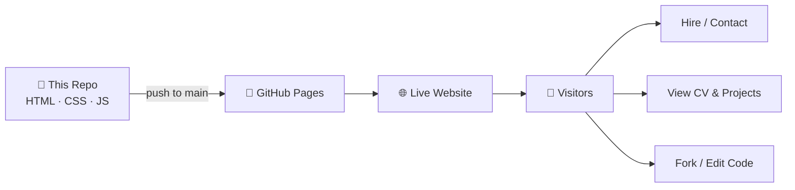

<p align="center">
  
</p>

<h1 align="center">Fatma Analytics</h1>

<p align="center">
  <strong>Official portfolio website</strong> for <strong>Fatma Elshall</strong> — Freelance Data Analyst & BI Specialist<br>
  <em>الموقع الرسمي لعرض أعمال ومهارات فاطمة الشال — محللة بيانات ومستقلة</em>
</p>

<p align="center">
  <a href="https://ibrahim1962001.github.io/Fatma-Analytics/"></a>
  <a href="https://ibrahim1962001.github.io/Fatma-Analytics/resume.html"></a>
  <a href="mailto:fatmaalshall2000@gmail.com"></a>
</p>

<p align="center">
  
  
  
  
</p>

<p align="center">
  📖 <a href="docs/README.ar.md"><strong>دليل عربي كامل — اقرأ شرح الريبو بالعربية</strong></a>
</p>

---

## ايه ده؟ / What is this repository?

| | |
|---|---|
| **🇪🇬 العربية** | ده **مصدر كود موقع البورتفolio** الخاص بـ **فاطمة الشال** — مش مشروع تحليل بيانات، ده **الموقع اللي بيعرض** شغلها، مشاريعها، CV بتاعها، ووسائل التواصل. أي تعديل هنا = تعديل على الموقع المنشور. |
| **🇬🇧 English** | This repo holds the **source code of a personal portfolio website** for **Fatma Elshall**, a freelance Data Analyst. It is **not** a data project — it is the **marketing site** that showcases her work, resume, and contact info. |



---

## عايز تعمل ايه؟ / What do you want to do?

| أنت / You want to… | افتح / Open |
|--------------------|-------------|
| **تشوف الموقع شغال** / View the live portfolio | 👉 **[ibrahim1962001.github.io/Fatma-Analytics](https://ibrahim1962001.github.io/Fatma-Analytics/)** |
| **تشوف أو تحمّل CV** / View or print resume | 👉 [resume.html](https://ibrahim1962001.github.io/Fatma-Analytics/resume.html) · [resume.txt](https://ibrahim1962001.github.io/Fatma-Analytics/resume.txt) (ATS) |
| **توظّفها أو تطلب مشروع** / Hire for analytics work | 👉 [LinkedIn](https://www.linkedin.com/in/fatma-elshall/) · [Email](mailto:fatmaalshall2000@gmail.com) · Contact form on site |
| **تشوف مشاريع التحليل** / See data analysis repos | 👉 [github.com/fatma-elshall](https://github.com/fatma-elshall) |
| **تعدّل الموقع محلياً** / Edit the site locally | 👉 [Local setup ↓](#-local-setup--التشغيل-محليا) |
| **تفهم كل ملف بيعمل ايه** / Understand each file | 👉 [File guide ↓](#-file-guide--دليل-الملفات) |

---

## Table of Contents

- [About Fatma Elshall](#about-fatma-elshall)
- [What's on the website](#whats-on-the-website)
- [Featured projects](#featured-projects)
- [File guide](#-file-guide--دليل-الملفات)
- [Tech stack](#tech-stack)
- [Local setup](#-local-setup--التشغيل-محليا)
- [Deploy (GitHub Pages)](#deploy-github-pages)
- [Contact & links](#contact--links)
- [FAQ](#faq)
- [License](#license)

---

## About Fatma Elshall

**Fatma Elshall** — Data Analyst & Freelancer based in **Cairo, Egypt**.

She helps business owners turn messy spreadsheets and raw data into **dashboards, automated reports, and decisions that save time**.

| | |
|---|---|
| **Experience** | 2+ years in analytics |
| **Projects** | 15+ delivered |
| **Impact** | 30–40% average reduction in manual reporting time |
| **Languages** | Arabic (native) · English (professional) |
| **Top certification** | Google Advanced Data Analytics Professional Certificate |

**Clients & sectors:** GOSI (Saudi Arabia) · Saudi Military Hospital · AL-Nahdy · Ministry of Defense (Egypt) · Zon Net · DEPI · Healthcare · HR · E-Commerce · Telecom · Finance

---

## What's on the website

The live site (`index.html`) is a **single-page portfolio** with these sections:

| # | Section | What you'll find |
|---|---------|------------------|
| 1 | **Hero** | Name, role, stats (15+ projects, 40% time saved), call-to-action buttons |
| 2 | **Impact** | Key results and reach |
| 3 | **About** | Professional summary and career highlights |
| 4 | **Services** | Dashboards, automation, data cleaning, KPI analytics, recommendations |
| 5 | **Clients** | Organizations she worked with |
| 6 | **Process** | 4-step workflow: Discovery → Audit → Build → Delivery |
| 7 | **Projects** | Case studies in **Problem → Approach → Result** format |
| 8 | **Experience** | Timeline: freelance, Zon Net, DEPI, ITI, competitions |
| 9 | **Skills** | SQL, Python, Excel, Tableau, Looker Studio, GA4, etc. |
| 10 | **Certifications** | Google, IBM, Deloitte, NVIDIA, ITI, ALX |
| 11 | **Education** | B.Sc. Electrical Engineering — Al-Azhar University |
| 12 | **Recommendations** | LinkedIn testimonials |
| 13 | **FAQ** | Tools, timeline, NDAs, pricing |
| 14 | **Contact** | Email, LinkedIn, Gmail contact form |

**Separate pages:**

| File | Purpose |
|------|---------|
| `resume.html` | Clean printable CV — use browser **Print → Save as PDF** |
| `resume.txt` | Plain-text CV for ATS / job application systems |

---

## Featured projects

| Project | Client / Context | Tools | Result |
|---------|------------------|-------|--------|
| Medical Data Analysis | Military Hospital · 6 health centers | Excel, Data Modeling | 20–30% reporting efficiency |
| Employee Performance | GOSI · Saudi Arabia | Looker Studio, Google Workspace | 35%+ less manual HR reporting |
| Recruitment Automation | Zon Net Digital Solutions | Google Forms, Drive | 50% less manual file handling |
| Amazon Sales Analysis | E-Commerce | Excel | 8,000+ duplicates cleaned |
| GA4 E-Commerce Dashboard | E-Commerce | GA4, Looker Studio | Full purchase funnel |
| Telecom Churn | Telecom | Python, Tableau | Retention strategies |
| Superstore Sales | DEPI graduation | SQL, Python, Tableau | [Live Tableau ↗](https://public.tableau.com/app/profile/fatma.elshall/vizzes) |
| Stock Market Analysis | Finance | Python, Tableau | Technical analysis dashboard |
| Call Center KPIs | Customer Service | Excel | 20% wait time reduction |

> 🔒 Some client work is **NDA-protected** — shown as anonymized case studies on the site.

**Public code repos:** [github.com/fatma-elshall](https://github.com/fatma-elshall)

---

## 📂 File guide / دليل الملفات

```
Fatma-Analytics/
│
├── index.html              ← 🏠 Main portfolio (start here)
├── resume.html             ← 📄 CV for viewing & printing as PDF
├── resume.txt              ← 📋 Plain-text CV for job portals (ATS)
├── styles.css              ← 🎨 All visual design & responsive layout
├── script.js               ← ⚙️ Menu, animations, contact form, scroll
│
├── assets/
│   └── profile.png         ← 🖼️ Profile photo + site favicon
│
├── .github/workflows/
│   └── pages.yml           ← 🚀 Auto-deploy to GitHub Pages on push
│
├── README.md               ← 📖 You are here — repo documentation
├── LICENSE                 ← ⚖️ MIT license for site code
└── .gitignore              ← Git ignore rules
```

| File | Edit when you want to… |
|------|------------------------|
| `index.html` | Change text, projects, sections, links, contact info |
| `styles.css` | Change colors, fonts, spacing, mobile layout |
| `script.js` | Change menu behavior, animations, contact email |
| `assets/profile.png` | Replace profile photo |
| `resume.html` / `resume.txt` | Update CV content |
| `.github/workflows/pages.yml` | Change deployment settings (rarely needed) |

---

## Tech stack

| | |
|---|---|
| **Website** | HTML5 · CSS3 · Vanilla JavaScript — **no React, no npm, no build step** |
| **Design** | Custom dark theme, sage-green accent, Inter font, fully responsive |
| **Hosting** | GitHub Pages via GitHub Actions |
| **Fatma's analytics tools** | SQL · Python · Excel · Tableau · Looker Studio · Power Query · GA4 · MySQL |

---

## 💻 Local setup / التشغيل محليا

```bash
# 1. Clone
git clone https://github.com/ibrahim1962001/Fatma-Analytics.git
cd Fatma-Analytics

# 2. Run a local server (pick one)
python -m http.server 8080
# OR: npx serve .

# 3. Open in browser
# http://localhost:8080
```

Open `index.html` directly in a browser also works for quick preview (some features work best with a local server).

---

## Deploy (GitHub Pages)

Deployment is **automatic** when you push to `main`.

| Step | Action |
|------|--------|
| 1 | Push code to `main` branch |
| 2 | GitHub Actions runs [`.github/workflows/pages.yml`](.github/workflows/pages.yml) |
| 3 | Site publishes at **https://ibrahim1962001.github.io/Fatma-Analytics/** |

**First-time setup:** Repo **Settings → Pages → Source → GitHub Actions**

---

## Contact & links

| | Link |
|---|------|
| 🌐 **Live portfolio** | [ibrahim1962001.github.io/Fatma-Analytics](https://ibrahim1962001.github.io/Fatma-Analytics/) |
| 💼 **LinkedIn** | [linkedin.com/in/fatma-elshall](https://www.linkedin.com/in/fatma-elshall/) |
| 💻 **GitHub (data projects)** | [github.com/fatma-elshall](https://github.com/fatma-elshall) |
| 📊 **Tableau Public** | [fatma.elshall](https://public.tableau.com/app/profile/fatma.elshall/vizzes) |
| 🏆 **Kaggle** | [kaggle.com/fatmaelshall](https://www.kaggle.com/fatmaelshall) |
| ✉️ **Email** | [fatmaalshall2000@gmail.com](mailto:fatmaalshall2000@gmail.com) |
| 📍 **Location** | Kfr Elshikh, Cairo, Egypt |

**Status:** ✅ Available for freelance projects — dashboards, reporting automation, data cleaning, BI consulting.

---

## FAQ

<details>
<summary><strong>Is this a data analysis project or a website?</strong></summary>

It's a **website** (portfolio). The actual data projects live in [github.com/fatma-elshall](https://github.com/fatma-elshall). This repo only hosts the site that presents them.
</details>

<details>
<summary><strong>Do I need Node.js or Python packages to run it?</strong></summary>

No. It's plain HTML/CSS/JS. Python or `npx serve` is only optional for local preview.
</details>

<details>
<summary><strong>How do I download the CV as PDF?</strong></summary>

Open [resume.html](https://ibrahim1962001.github.io/Fatma-Analytics/resume.html) → browser menu → **Print** → **Save as PDF**. Or use the "Download CV" button on the homepage.
</details>

<details>
<summary><strong>Who designed the portfolio?</strong></summary>

Site design by [Ibrahim Sabry](https://www.linkedin.com/in/ibrahimsabrey). Content and analytics work by Fatma Elshall.
</details>

<details>
<summary><strong>هل الموقع متاح بالعربي؟</strong></summary>

المحتوى الأساسي بالإنجليزي (للعملاء الدوليين). فاطمة تتحدث العربية والإنجليزية — التواصل متاح باللغتين.
</details>

---

## Related repositories

Analytics project code (linked from the portfolio):

- [Employee Performance & Productivity Analysis](https://github.com/fatma-elshall/Employee-performance-and-productivity-analysis)
- [Amazon Sales Dashboard](https://github.com/fatma-elshall/Amazon-sales-dashboard)
- [GA4 E-Commerce Insights Dashboard](https://github.com/fatma-elshall/GA4--Ecommerce-Insights-Dashboard)
- [Telecom Customer Churn Analysis](https://github.com/fatma-elshall/Telecom-Customer-Churn-Analysis)
- [Stock Market Analysis](https://github.com/fatma-elshall/Stock-Market-Analysis)
- [Call Center Data Analysis](https://github.com/fatma-elshall/Call-center-data-analysis)
- [DEPI Graduation Project](https://github.com/fatma-elshall/DEPI_gradution_project)

---

## License

Site code: [MIT License](LICENSE) © 2026 Fatma Elshall.

Portfolio content, case studies, and client narratives remain the intellectual property of Fatma Elshall.

---

<p align="center">
  <strong>Fatma Analytics</strong><br>
  From scattered data to clear decisions.<br>
  <em>من البيانات المتفرقة إلى قرارات واضحة</em>
</p>

<p align="center">
  <a href="https://ibrahim1962001.github.io/Fatma-Analytics/">Open Live Site →</a>
</p>
